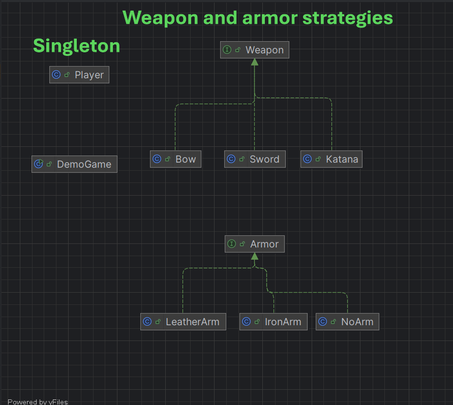

### Strategy Pattern
Strategy- არის პატერნი, რომელიც საშუალებას გვაძლევს განვსაზღვროთ "სტრატეგიების ოჯახი"

strategy- პატერნის საშუალებით შესაძლებელია პროგრამის მსვლელობის დროს დინამიურად ჩავანაცვლოთ კლასის რაიმე თვისება

ჩვენ მაგალითში არის ორი სტრატეგიის ინტეფეისი ესენია:
<br>
(1) Weapon<br>
(2) Armor

და გვაქვს ამ ინტერფეისების "კონკრეტული სტრატეგიები"-ს იმპლიმენტაციები:<br>
(1)Weapon-Sword, Bow, Katana<br>
(2)Armor-IronArm, LeatherArm, NoArm


გეიმპლეის კლასში კი დინამიურად ვახდენთ weapon/armor-ის ჩანაჩვლებას:
```java
player.getNewArmor(new IronArm());
player.getNewWeapon(new Bow());
```